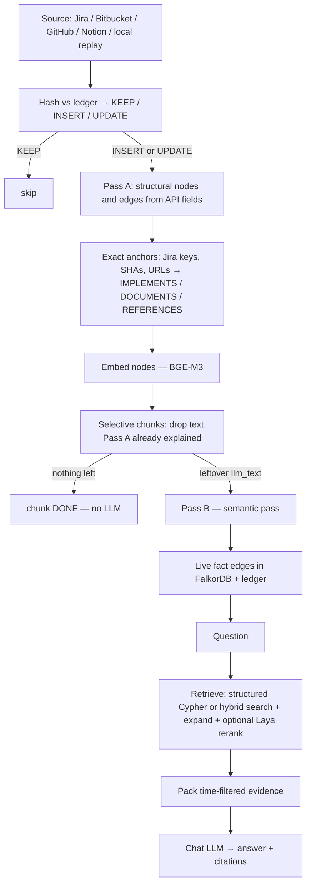
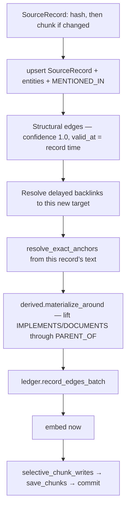
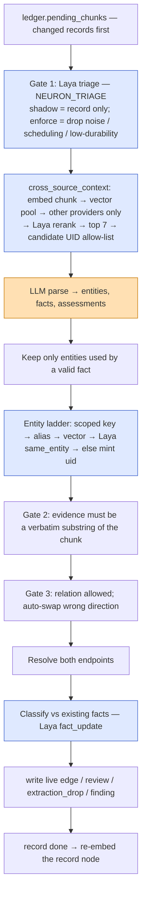
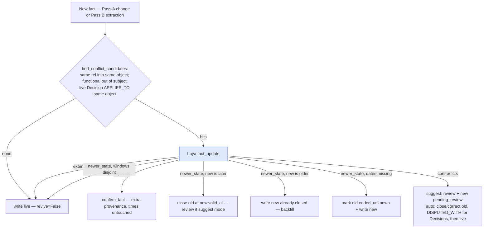
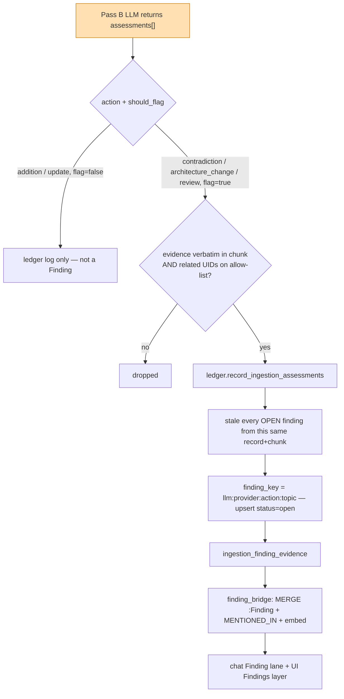
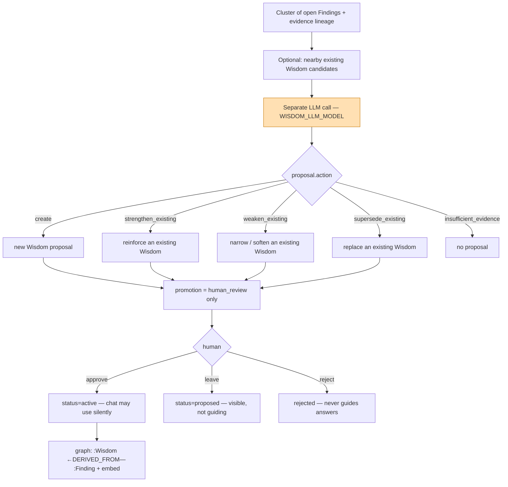
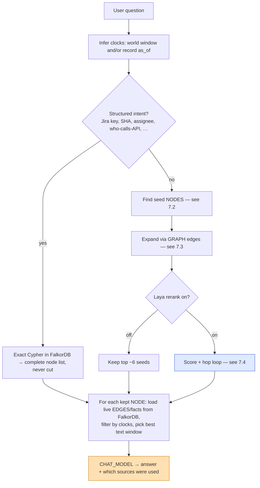
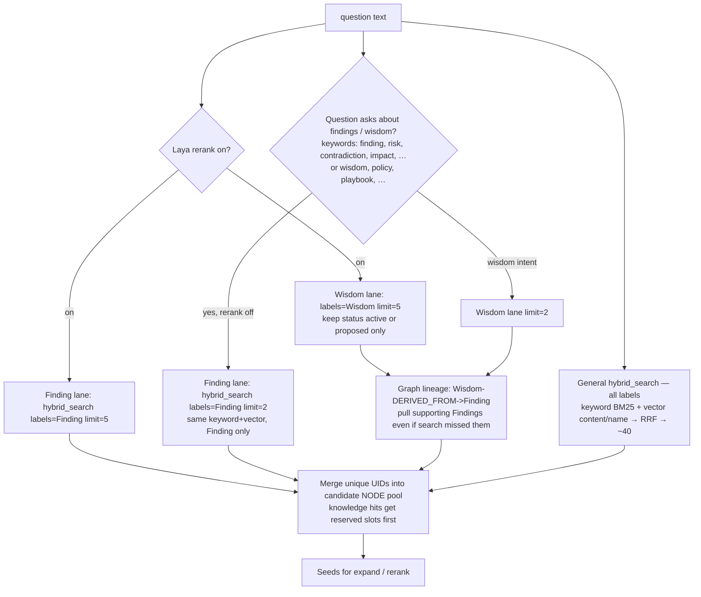
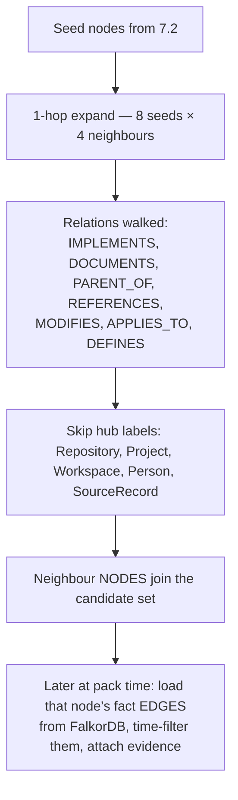
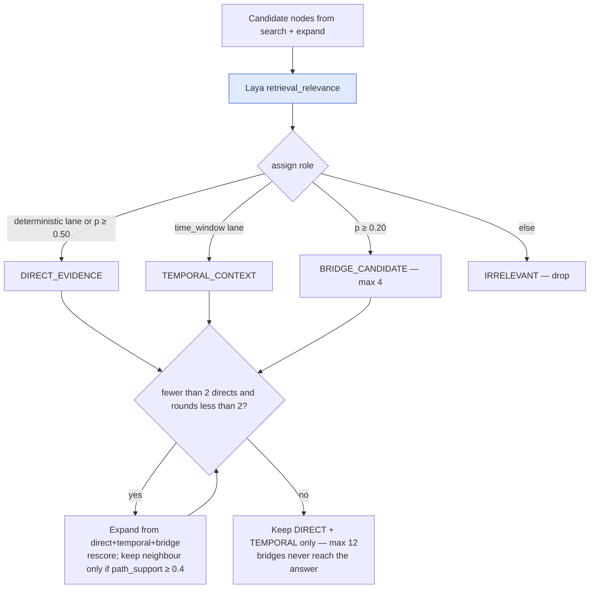

# Neuron — ingest to retrieve

How a record becomes facts, how those facts change over time, how findings appear, and how a question is answered.

Orange in diagrams = LLM. Blue = Laya or vector similarity. Everything else is deterministic.

---

## 1. End to end

Unchanged hash → nothing is reprocessed. UPDATE first removes this record’s support from old edges; an edge with no remaining support is closed into `FactHistory`.

GitHub: Pass A only (no chunks, no Pass B). Local Jira/Bitbucket replay: Pass A, chunks left pending, no Pass B in that run.

---

## 2. Pass A — deterministic write

Typical structure: Jira `BELONGS_TO` / `ASSIGNED_TO` / `PARENT_OF` / `BLOCKS`; Bitbucket `CONTAINS` / `AUTHORED_BY` / `MODIFIES`; Notion `CONTAINS` / `PARENT_OF`. Single-valued Jira fields (assignee, status) supersede the old edge and archive it to `FactHistory`.

What the LLM later sees is only `llm_text`: units that still have unexplained meaning (not already covered by an exact anchor + a relation word, unless they also have a semantic cue like “decided” / “must”).

---

## 3. Pass B — semantic pass

Pending chunks, highest `semantic_priority` first (changed records). Budget `LLM_BUDGET_PER_RUN`. LLM calls concurrent; **writes serial** on the main thread.

**Entity ladder (first hit wins):** drop generic mentions → same scoped key → approved alias → vector ≥ 0.90 merge → 0.75–0.90 gray zone → Laya `same_entity` (suggest mode: review + new uid; auto: merge, except Decisions always reviewed) → mint.

**Identity scope:** Decision is record-scoped. Term/System are namespace-scoped (owning Project / Repo / Workspace). Api/Endpoint are global by name.

Dropped items land in `extraction_drops` (`evidence_not_in_chunk`, `relation_not_allowed`, `endpoint_unresolved`, `laya_triage_skip`, …).

LLM facts: `extraction_method=llm`, `confidence=0.9`. `valid_at` = date stated in the evidence, else record time.

---

## 4. Temporal facts — store and update

Every live edge has two clocks:

| Axis | Question | Live edge | History row |
|---|---|---|---|
| World time | When was this true? | `valid_at` / `invalid_at` | `valid_from` / `valid_to` |
| Record time | When did Neuron know? | `first_seen_at` / `last_confirmed_at` | `observed_from` / `observed_to` |

Nothing is hard-deleted from history. Close / supersede / correct always archives the interval into `FactHistory` first. Corrections set `assertion_status=corrected` and a zero-width interval. Pinned facts are never destroyed automatically.

**Structural single-valued** (Jira assignee): `supersede_fact_edges` — no Laya. **Text facts** use the classifier above; default `NEURON_FACT_UPDATE_MODE=suggest`.

**At query time:** “in August 2026” → world window. “what did we know on 2026-09-10” → record-time `as_of`. Only each hit’s facts are filtered (`holds_at` / `held_at`). Search itself is not time-filtered. Undated facts drop out of dated reads.

---

## 5. New findings — types and write path

A finding is **not** a second LLM call. On the same Pass B parse the model also emits `assessments[]`. Only some of those become Findings.

### 5.1 Assessment / finding types (`action`)

| `action` | Meaning | Usually `should_flag`? |
|---|---|---|
| `addition` | New durable claim / dependency / capability | no — logged only |
| `update` | Same topic changed (newer state of something known) | no — logged only |
| `contradiction` | New evidence conflicts with what we already hold | **yes** → Finding |
| `architecture_change` | Broad system / dependency / API shape shift | **yes** → Finding |
| `review` | Ambiguous evidence; a human should look | **yes** → Finding |

Prompt rule: flag only contradiction, broad architecture/dependency change, or genuine ambiguity. Ordinary additions/updates stay unflagged.

| Field | Role |
|---|---|
| `topic_key` | Stable kebab id for the same real-world change across sources |
| `severity` | `info` / `warning` / `high` / `critical` (default `warning` when stored) |
| `kind` on the Finding | `llm_<action>` e.g. `llm_contradiction` |
| `related_candidate_uids` | Must sit on the Pass B candidate allow-list or the assessment is dropped |

### 5.2 How a Finding is written

Ledger lifecycle: `open ↔ stale`. Same topic raised again reopens it. Dedup is **per provider** (Jira and Notion can each raise the same topic). Graph link is only `MENTIONED_IN` — no `FLAGS` edge to the entities it is about.

---

## 6. Wisdom generation loop

Wisdom is **durable guidance distilled from clusters of findings**, not from raw tickets. Types: `Policy` | `Principle` | `Pattern` | `AntiPattern` | `Playbook` | `Heuristic`.

**Designed loop** (`graph/retrieval/wisdom.py::generate_wisdom_proposal`):

Chat rules when Wisdom nodes exist: `active` steers answers quietly; `proposed` is awaiting review; `rejected` is ignored. The Wisdom lane also walks `(:Wisdom)-[:DERIVED_FROM]->(:Finding)`.

**What is wired today vs not:**

| Exists | Missing (open work) |
|---|---|
| `Wisdom` label, indexes, embeddings | Nothing calls `generate_wisdom_proposal` outside tests |
| Chat Wisdom lane + prompt rules | Nothing writes `:Wisdom` or `DERIVED_FROM` at runtime |
| Proposal schema + aggregation prompt | No scheduler / UI to cluster findings → propose → approve |

Until a writer exists, the Wisdom lane returns empty unless nodes are inserted some other way.

---

## 7. Retrieval — vectors, graph, then rerank

There is **no tool-calling agent**. The answer LLM never picks Cypher. Flow in plain steps:

1. Infer time clocks from the question.
2. Try a **structured** Cypher shortcut (exact intent).
3. Else **find candidate nodes** (keyword + vectors + a few special lanes).
4. **Walk the graph** one hop to bring in related nodes (and their edges/facts).
5. Optionally **Laya-rerank** those candidates into direct / temporal / bridge / irrelevant.
6. **Pack** time-filtered facts + text windows → chat LLM → citations.

### 7.1 Big picture

### 7.2 How nodes are found (vectors + keyword + findings)

Hybrid search builds a **pool of entity nodes** (WorkItem, Document, Decision, Commit, Finding, …). Facts/edges are **not** embedded — only nodes are. Findings are `:Finding` nodes (embedded like everything else after Pass B), then pulled into chat via a **dedicated Finding lane** so ordinary tickets cannot crowd them out.

**How a Finding enters the pool**

| Path | When | What |
|---|---|---|
| **Finding lane** | Question matches finding intent (`finding`, `risk`, `contradiction`, `impact`, `conflict`, …), **or** Laya rerank is on | `hybrid_search(..., labels=["Finding"])` — BM25 + vector on Finding nodes only (limit 2 if intent-only, limit 5 if Laya) |
| **Wisdom lineage** | Any Wisdom hit was retrieved | Cypher `(Wisdom)-[:DERIVED_FROM]->(Finding)` adds those Findings with method `wisdom-lineage` |
| **General hybrid** | Always (Finding is in `FULLTEXT_LABELS`) | A Finding can also rank into the general top-40, but without the lane it often loses to denser WorkItem/Document hits |
| **Structured shortcut** | “What breaks if we remove X” | Exact Cypher over open Findings of kind `removed_dependency_still_called` (complete list, never cut) — separate from hybrid |

Reserved-slot rule when the user asked for findings/wisdom: keep up to 2 Wisdom + their lineage Findings + up to 2 Finding-lane hits first, then fill the rest of the budget from general hits.

Other seed lanes (still nodes, not edges):

- **Pair:** question names two anchors (keys, SHAs, paths, people) → both nodes.
- **Named person:** fuzzy match + `SAME_AS` cluster.
- **Time window:** dated question → nodes whose edges have `valid_at` in the window.

### 7.3 How the graph adds nodes and edges

Seeds alone are often incomplete. Neuron walks **live fact edges** in FalkorDB:

Authority tags on how a node was reached: deterministic / exact_anchor / changelog = primary; llm = secondary; derived = derived. Primary lanes are never demoted by the reranker.

### 7.4 How the reranker works

Stage 1 is always RRF (above). Stage 2 is optional Laya `retrieval_relevance` — **not** an LLM, **not** a cross-encoder. Chat default = **off**.

For each candidate node Laya sees `[Label] Name` + up to 6 linked/temporal facts (300 tokens) and returns p(needed to answer).

**path_support** (how tightly a neighbour sits next to the seeds): direct edge 1.0, two-hop 0.8, name in text 0.7, shared SourceRecord 0.5, else 0.01. Below 0.4 → reject that hop.

Any Laya exception → fall back to the plain RRF list (`retrieval.fallback`).

Optional agentic retry (off by default): if still &lt; 2 keeps, one small LLM plans ≤ 2 extra search strings, hybrid_search each, Laya once more. Planner never answers and never writes.

### 7.5 Pack → answer → cite

For each kept **node**:

1. Load its fact **edges** from FalkorDB.
2. Filter by the query clocks (`holds_at` / `held_at`); cap ~25 facts; asserted before derived.
3. Take the best ~500-token text window (most distinct question terms).
4. Fit under a ~10k token budget (shrink window → trim facts → drop block).

Chat LLM returns `{answer, used_sources}`. Citations map those names back to packed `record_key`s under ACL. Findings/Wisdom become `knowledgeCitations`. Mean path_support of cited nodes &lt; 0.4 → `lowSupport`. Thumbs-up turns cited nodes into link candidates for review.
