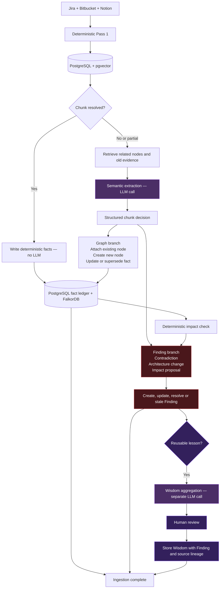

# Neuron ingestion flow — simple version

- The same structured chunk decision feeds the graph-update and Finding branches in parallel.
- Deterministic facts also run an impact check and can create or update a Finding without another LLM call.
- Wisdom runs after Findings as a separate aggregation call; it never derives organisational wisdom directly from a raw chunk.
