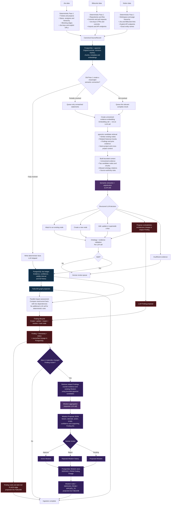

# Neuron ingestion, findings, and wisdom flow

```mermaid
flowchart TD
    %% -------------------- Sources --------------------
    J[Jira data] --> J1["Deterministic Pass 1<br/>• Tickets and projects<br/>• Status, assignee and hierarchy<br/>• Blocking edges<br/>• Jira keys and explicit URLs"]
    B[Bitbucket data] --> B1["Deterministic Pass 1<br/>• Repositories and files<br/>• Commits and pull requests<br/>• Jira keys in PRs and commits<br/>• Imports and API endpoints"]
    N[Notion data] --> N1["Deterministic Pass 1<br/>• Workspace and page hierarchy<br/>• Jira and Bitbucket links<br/>• Explicit API endpoints<br/>• Exact entity names"]

    %% -------------------- Canonical storage --------------------
    J1 --> C[Canonical SourceRecord]
    B1 --> C
    N1 --> C
    C --> P["PostgreSQL + pgvector<br/>Original records, versions, hashes,<br/>chunks, metadata and embeddings"]

    %% -------------------- Selective AI routing --------------------
    P --> R{"Did Pass 1 create a meaningful<br/>semantic connection?"}
    R -->|Fully resolved| DW["Write deterministic facts<br/>LLM skipped"]
    R -->|Partially resolved| PU["Queue only unmatched statements"]
    R -->|Not resolved| UU["Queue the relevant complete chunk"]

    PU --> EM["Create unresolved-evidence embedding<br/>Embedding call — not an LLM call"]
    UU --> EM
    EM --> VS["pgvector candidate retrieval<br/>• Similar existing nodes<br/>• Related historical chunks<br/>• Findings and prior evidence<br/>• Same-project and cross-project context"]
    VS --> PK["Build bounded context<br/>• Unresolved evidence<br/>• Top candidate nodes and chunks<br/>• Allowed ontology relations<br/>• Source-authority rules"]

    %% -------------------- Semantic LLM boundary --------------------
    PK --> LLM["Semantic extraction + adjudication<br/>(LLM call)"]
    LLM --> LD{"Structured LLM decision"}
    LD --> A[Attach to an existing node]
    LD --> NEW[Create a new node]
    LD --> UP[Add, update or supersede a fact]
    LD --> CON["Propose contradiction,<br/>architecture change or impact Finding"]
    LD --> UNC[Insufficient evidence]

    %% -------------------- Deterministic validation --------------------
    A --> V["Ontology + evidence validation<br/>No LLM call"]
    NEW --> V
    UP --> V
    CON --> V
    V --> V1{Valid?}
    V1 -->|No| HR[Human review queue]
    UNC --> HR
    V1 -->|Yes| FL["PostgreSQL fact ledger<br/>Evidence, confidence, validity interval<br/>and full history"]
    DW --> FL

    %% -------------------- Graph and findings --------------------
    FL --> FK[FalkorDB graph projection]
    FL --> IMP["Parallel impact assessment<br/>Compare new/current facts with live dependencies<br/>No additional LLM call for deterministic rules"]
    FK --> IMP
    CON --> FP[LLM Finding proposal]
    IMP --> FIND["Finding lifecycle<br/>Create • update • reopen • resolve • mark stale"]
    FP --> FIND
    FIND --> FS["Finding + timestamp + status<br/>+ source/fact lineage in PostgreSQL"]
    FS --> FKG["Finding node and dark-red FLAGS edge<br/>projected into FalkorDB"]

    %% -------------------- Wisdom aggregation --------------------
    FS --> WG{"New or materially changed<br/>Finding cluster?"}
    WG -->|No| END[Ingestion complete]
    WG -->|Yes| WV["Retrieve related Findings,<br/>counter-evidence and existing Wisdom<br/>using bounded pgvector candidates"]
    WV --> WP["Wisdom aggregation<br/>(separate LLM call)"]
    WP --> WJ["Wisdom Proposal JSON<br/>lesson, rationale, action, scope,<br/>confidence and supporting Finding IDs"]
    WJ --> WR{Human review}
    WR -->|Approve| WA[Active Wisdom]
    WR -->|Reject| WRE[Rejected Wisdom history]
    WR -->|Pending| WPR[Proposed Wisdom]
    WA --> WS["PostgreSQL Wisdom store<br/>DERIVED_FROM Finding lineage"]
    WPR --> WS
    WRE --> WS
    WS --> WFK["Wisdom node + DERIVED_FROM / APPLIES_TO<br/>projected into FalkorDB"]
    FK --> END
    FKG --> END
    WFK --> END

    classDef llm fill:#4b2e66,stroke:#b57cff,color:#fff;
    classDef finding fill:#4a171b,stroke:#b3262d,color:#fff;
    classDef wisdom fill:#33205c,stroke:#8b5cf6,color:#fff;
    classDef store fill:#123047,stroke:#60a5fa,color:#fff;

    class LLM,WP llm;
    class CON,FP,FIND,FS,FKG finding;
    class WG,WV,WJ,WR,WA,WRE,WPR,WS,WFK wisdom;
    class P,FL,FK store;
```
